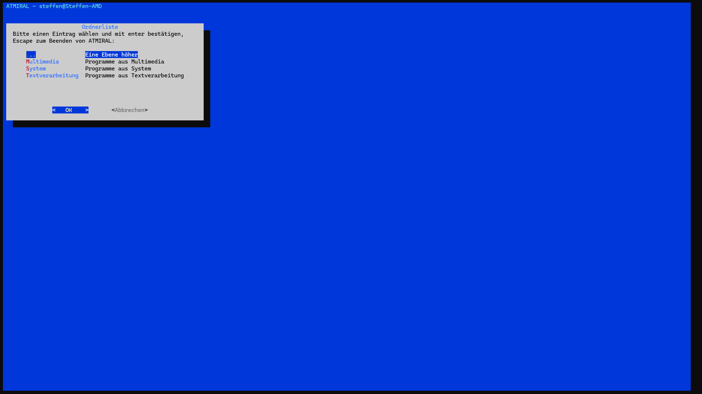

# ATMIRAL
Accessible text-based menu interface for running applications on Linux

🌐 [Deutsch](./README-de.md) | [English](./README.md)

## Description

[](./screenshot.png)

ATMIRAL (short for "Accessible text-based menu interface for running applications on Linux") is a user-friendly start menu for the Linux shell, allowing you to quickly access frequently used programs and commands. The menu can be customised using a folder structure with human-readable text files, making it adaptable to any Linux system. It is ideal for beginners, helping them to overcome their fear of entering commands, and for those who prefer to restrict certain processes to a specific working environment. However, it is not intended to replace command input or a complete graphical user interface. The following modules are currently available: 

* ATMIRAL (`atmiral.sh`): The main program with customizable sets of commands.
* ATMIRAL File Browser (`atmiralfm.sh`): A simple file browser to list and open files. 

## Installation

Clone the repository and make `install.sh` executable. 

```
chmod +x ./install.sh
```

The following installation options are available: 

* `./install.sh --user`: install for current user.
* `sudo ./install.sh --system`: install system-wide, requires root permissions. 
* `sudo ./install.sh --both`: install system-wide and for current user, requires root permissions. 
* `sudo ./install.sh --uninstall`: uninstall ATMIRAL, could require root permissions. 

All modules are available in the respective installation environment, e.g. `atmiral` for the main program or `atmiralfm` for the file browser. You can also run ATMIRAL by calling `./atmiral.sh`  in the script's directory, in case you prefer not to install it. 

## Using the main program

### Menu directories

Menu files are found in the following directories, descending priority: 

* Userdefined: call `atmiral <Pfad>`
* In your home folder: `$HOME/.local/share/atmiral/menu/`
* System-wide: `/usr/local/share/atmiral/menu/`
* In the script's directory (last fallback): `./menu/`

### Creating menus

A menu file consists of configuration sections separated by a blank line. Each configuration section can contain the following fields: 

* Name: Display name of the program or command (not the actual command)
* Description: Short description, displayed to the right.
* Command: The actual command that is called  from the menu entry.
* Arguments: Any type of fixed or dynamic command options. The text between `<` and `>` is recognized as a placeholder and the menu prompts for user input when the command is called.

The following placeholders are available to open special dialog boxes: 

* `<File>`: Opens a file selection dialog.
* `<Directory>`: Opens a directory selection.
* `<Password>`: Input box for passwords.

**Note**: The field names and placeholders above can be translated into any language. If ATMIRAL is being used in a language other than English, the field names and placeholders must also be specified in that language, provided they have been translated in the relevant language file. 

### Example

Here is a menu file with some system commands.

```
Name: Top
Description: System monitor
Command: top

# Here we use dialog to print system uptime as a nice message box
Name: Uptime
Description: Display system uptime
Command: dialog --no-lines --title "uptime" --msgbox "$(uptime)" 10 70

Name: Updates
Description: Search for updates
Command: sudo apt update && sudo apt upgrade

# In the following example <Text> is stored as an argument template and will be queried when called.
Name: TTS
Description: Speak entered text
Command: espeak-ng
Arguments: -v en -a 100 -s 300 "<Text>"

# Multiple placeholders are also possible, which are then queried one after the other before the command is called
Name: Service control
Description: Service control
Command: sudo systemctl
Arguments: <Action> <Service>
```

### The user interface

Once you have started ATMIRAL, the files and subfolders that have been created in the appropriate menu directory will be displayed as a two-column list containing the file names and descriptions. You can navigate through these lists using the up and down arrow keys, confirming your selection by pressing Enter. There is an option to return to the parent menu at the top of each list. While ATMIRAL is open, all commands are executed in its environment. This means that, after each command has been executed, you always return to the current menu. Pressing Escape exits the ATMIRAL interface and returns to the normal shell environment.

### Configuration

Some configuration options are available in the file `atmiral.conf`: 

* `ATMIRAL_LANG`: Interface language (language file name without file extension, e.g. `en`). 
* `COMMAND_DEBUG`: Set 1 to turn on command output.

If you prefer the menu to have a dark colour scheme, you will find a sample `.dialogrc` file in this folder which you can copy into your home directory. It contains the colours for dark mode and also sets the `visit_items` option to `ON` to enable better keyboard operation. However, this option is already set in the script when the menu is defined.

## File browser

The Admiral file browser can be launched using the command `atmiralfm` or `atmiralfm.sh` in the script directory. The home directory of the current user is set as the start directory by default. A different start directory can be specified as an argument when calling `atmiralfm`. Navigating through files and folders is straightforward and can be done using the up and down arrow keys, or by entering the first letter of an entry and confirming with the Enter key. As with many file managers, there is an option at the top of each list to move to the parent folder. In the top-left corner of the screen is a status bar similar to the shell prompt which displays the user and host name, as well as the current folder path. 

After selecting a file, or by pressing the actions button, a menu opens offering various options for the selected file or directory. The display may vary depending on the file type and installed packages. The following options are available:
 
* Open directory
* Open file (text, audio/video, images)
* Custom: Allows to enter a custom command to open the file.
* Execute: Checks whether the file is executable and starts it directly.
* Copy to: Copy file to another location
* Move to: Move file to another location.
* Delete: Removes the file after confirmation.
* Info: Display file information.
* Cancel: Closes the menu and returns to the file list.

### File browser configuration

The following options are available in `atmiral.conf`: 

* `SHOW_HIDDEN`: Show hidden files and directories
* `DEFAULT_EDITOR`: Default text editor, e.g. nano or vim
* `DEFAULT_VIEWER`: Default file viewer, e.g. less, more, w3m.
* `DEFAULT_PLAYER`: Default media player, e.g. mpv, vlc. 
* `DEFAULT_IMG_VIEWER`: Default image viewer, e.g. feh. 

## Development

Copyright (C) 2025 Steffen Schultz, released under the terms of the MIT license. 
